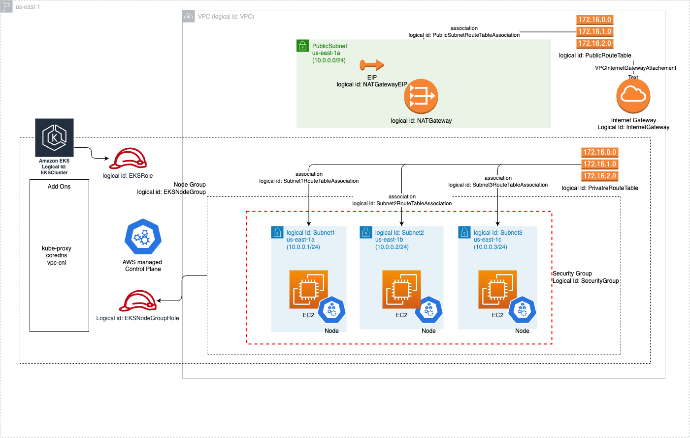

# CloudFormation code to provision EKS cluster



1. Setup variables via environment variables
    ```sh
    STACK_NAME=k8s-on-cloud-cluster
    FILE_PATH=template.yaml
    REGION=us-east-1
    ```

2. Create a new stack in CloudFormation
    ```sh
    aws cloudformation create-stack \
      --stack-name $STACK_NAME \
      --region $REGION \
      --template-body file://$FILE_PATH \
      --capabilities CAPABILITY_NAMED_IAM # as we are creating IAM roles with custom names
    ```

3. After making changes to the template, update the stack
    ```sh
    aws cloudformation update-stack \
      --stack-name $STACK_NAME \
      --region $REGION \
      --template-body file://$FILE_PATH \
      --capabilities CAPABILITY_NAMED_IAM
    ```

4. Get kubeconfig
    ```sh
      aws eks update-kubeconfig \
        --region $REGION \
        --name $STACK_NAME
    ```

### Clean up
    ```sh
    aws cloudformation delete-stack \
      --stack-name $STACK_NAME \
      --region $REGION
    ```