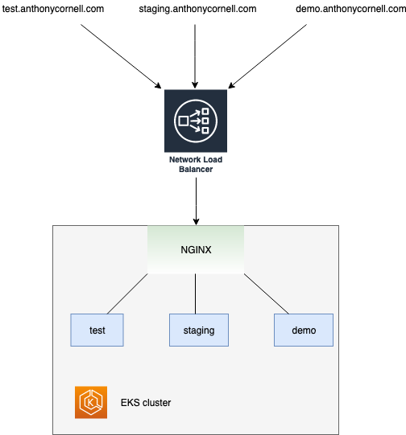

# This template demonstrate the use of ingress-nginx with Network Load Balancer (NLB) on AWS EKS cluster using Terraform.

**It is ingress-nginx instead of NGINX Ingress Controller.**

## Architecture

  
NGINX: the ingress-nginx controller

Reference: https://aws.amazon.com/blogs/opensource/network-load-balancer-nginx-ingress-controller-eks/, this doc uses NGINX-Ingress-Controller, but the concept is the same.

## What is included in this template
- A functioning EKS cluster
- Ingress-nginx controller 
- A simple nginx web server Deployment and its Service
- An Ingress that use the ingress-nginx as the Ingress Class
- A Private Hosted zone for testing the Ingress

## How to test
As the NLB URL is not static, please manually update the A Record in the Private Hosted Zone with the NLB URL, to point `nginx.example.com` and `apache.example.com` to the NLB URL.

Then, inside the VPC (or just use one of the worker node), curl the URL to test the Ingress.

```bash
curl nginx.example.com
curl apache.example.com
```

You should get the default nginx page and apache page respectively. We are using ONE NLB, ONE Ingress Controller, and TWO Ingresses to route the traffic to different services!
